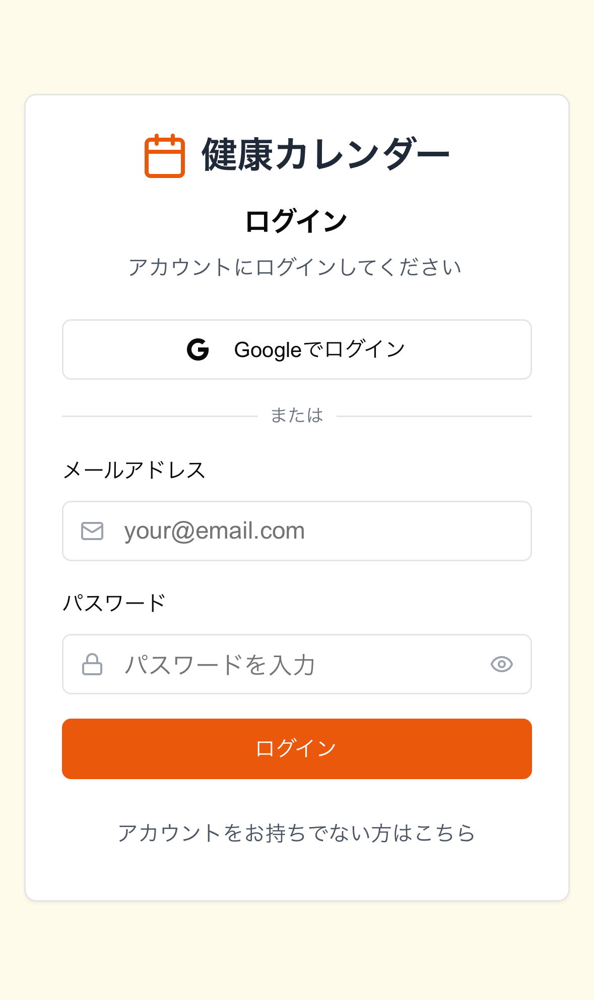
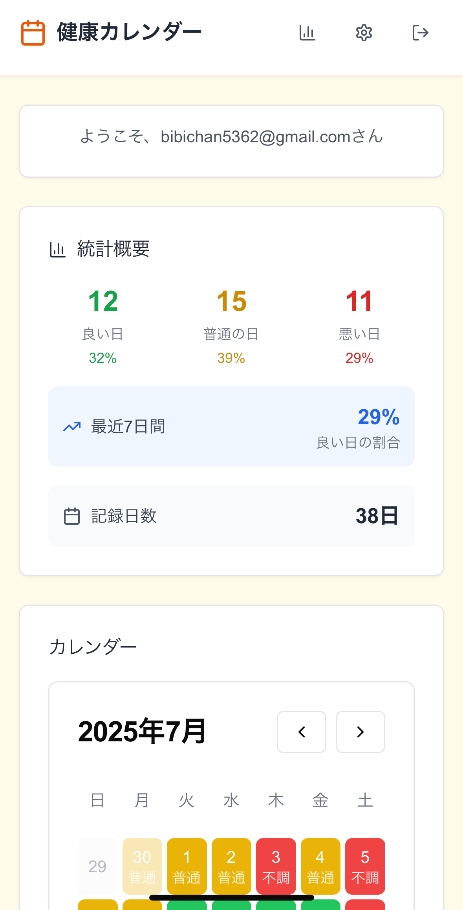
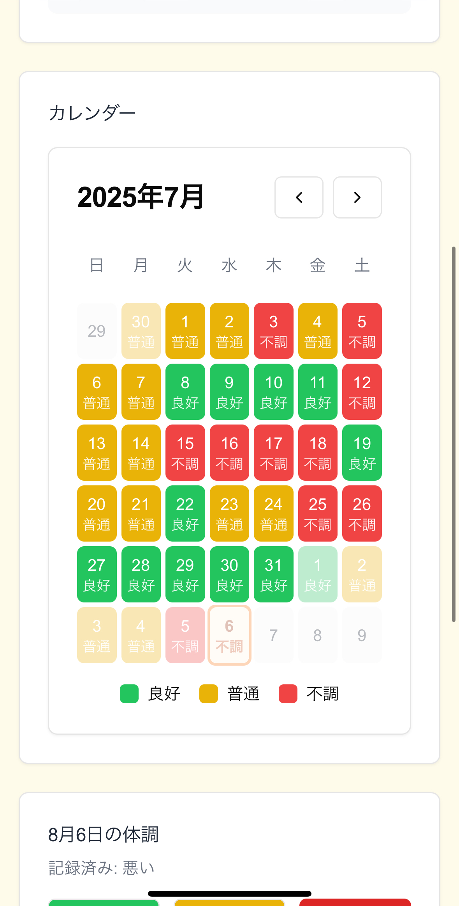
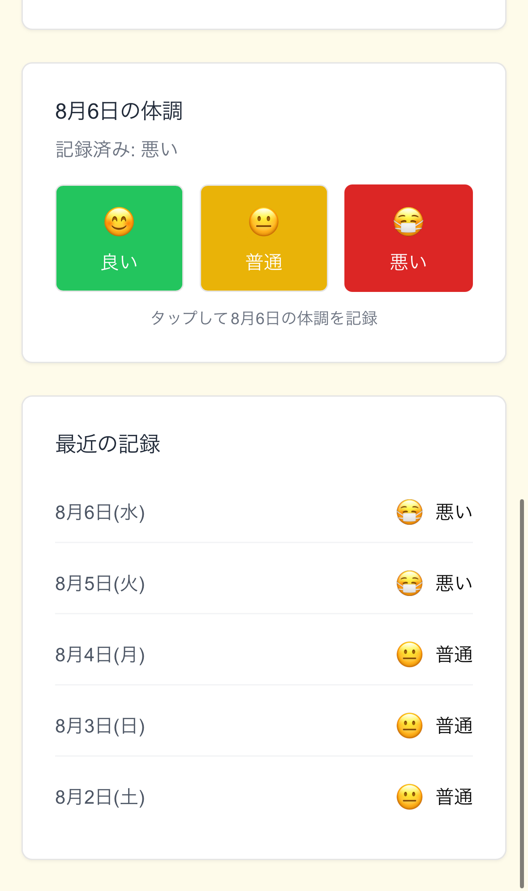
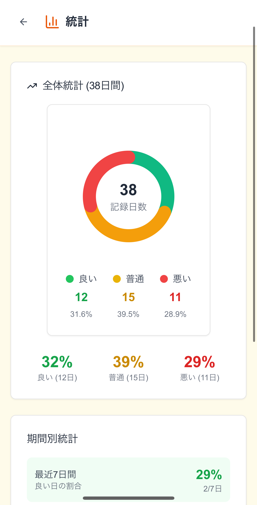

# 健康維持のためのアプリ
**calendar-app - 健康管理を簡単に。

## 概要
calendar-appは少し手間のかかる健康管理を簡単に可視化でき、めんどくさがりな方でも簡単に習慣化できるWEBアプリです。
開発途中にはなりますが簡単な動作確認が可能になっています、ぜひお試しください。

## テストアカウント
メールアドレス: myori311@risu.be
パスワード: Test0000

## URL

[https://v0-health-calendar-app-xl.vercel.app/](https://v0-health-calendar-app-xl.vercel.app/)

## iphone画面

 

 

<table>
  <tr>
    <td></td>
    <td></td>
  </tr>
  <tr>
    <td></td>
    <td></td>
  </tr>
  <tr>
    <td colspan="2" align="center">
      
    </td>
  </tr>
</table>
