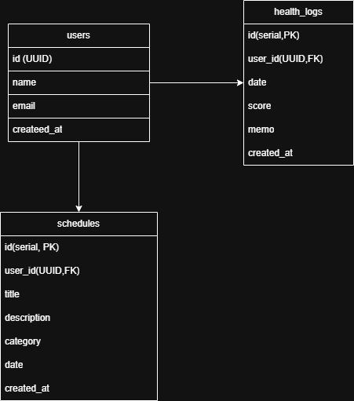

# 健康維持のためのアプリ

## 概要
このリポジトリは健康を目的にしています。

## 使用技術
- Node.js
- GitHub
- Supabase

## 画像

## 📊 バージョン履歴

### v1.4
- 体調管理のデータ共有

### v1.3
- ログイン機能の実施
- そのほかのエラー修正

### v1.2
- データベース設定
- 設定画面アクセス
- フォントサイズ調整 
- 週開始曜日 : スイッチで日曜/月曜を切り替え
- Google/Apple連携ボタンで設定

### v1.1
- データベース設定 
- サンプルデータ生成 
- グラフ表示 
- 期間切り替え 

### v1.0
- カレンダーで日付を選択
- 体調ボタン（😊良い / 😐普通 / 😷悪い）をタップ
- 記録された体調がカレンダーに色分け表示
- 統計で週間・月間の傾向を確認
